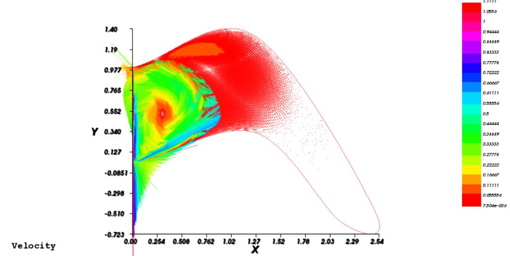
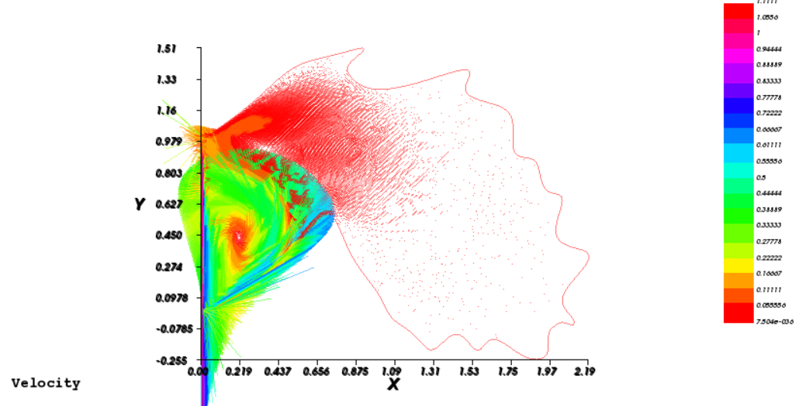
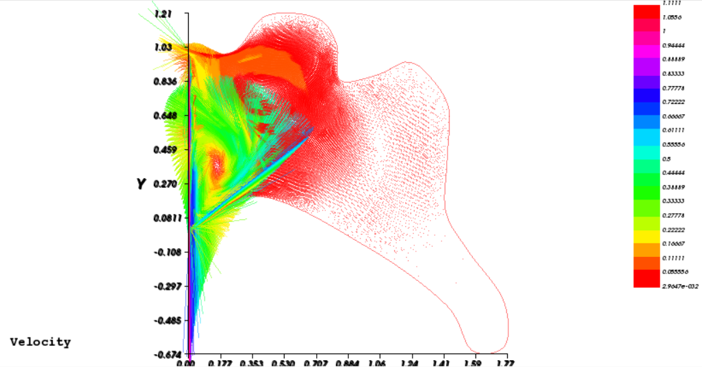
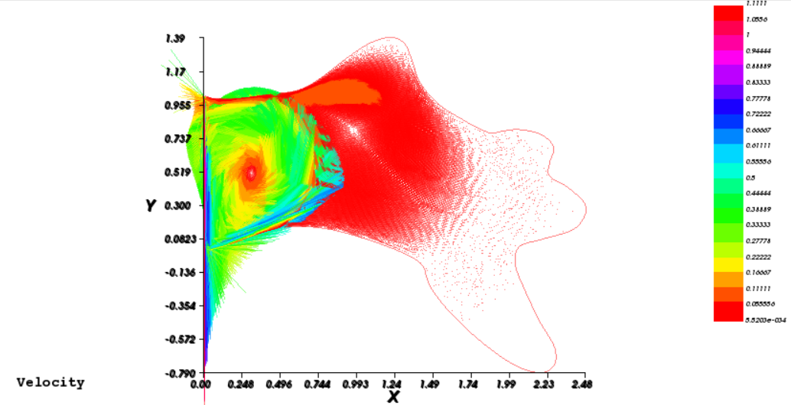

# Ranking Left Atrial Appendages (LAAs) by risk of thrombosis

## Theoretical framework
[Thrombosis](https://en.wikipedia.org/wiki/Thrombosis) occurs when blood becomes stagnant and forms clots which end up clogging its flow, causing clinical complications such as stroke, heart attack, and serious breathing problems. One region particularly affected by this risk is the Left Atrial Appendage (LAA):

Because of its position, it is a region prone to blood clots formation caused by the low velocity flow of blood [^1]. 

[^1]: https://pubmed.ncbi.nlm.nih.gov/25751618/ and https://www.frontiersin.org/articles/10.3389/fcvm.2018.00034/full 

In the literature, experts have found recurrent features which appear in many geoemtries. Thus, LAA geometries are divided into 4 categories:
* chicken wing (CW)
* windsock (WS)
* cactus (CS)
* cauliflower (CF)

## Goal:
The goal is ranking these four gemoetries in terms of their risk propensity to blood stagnation using a model-based approach.

## Shape models
To produce the meshes, we relied on [GMSH](https://gmsh.info/).

By far the easiest approach would be to directly and manually position by hand some points which describe the final four geometries and write in such a way the four `.geo` files. The problem with this approach is that it is too "robust", meaning that if we wanted to modify slightly some points in the meshes, we'd need to rewrite from scratch the entire `.geo` files. 

This is why to model the four geometries we used shape models based on [radial basis functions](https://en.wikipedia.org/wiki/Radial_basis_function). 

For each[^2] geometry:

[^2]: the choice for the control points needs to be geometry-specific.
1.   control points on the initial template mesh are manually selected and saved in a csv file;
2.   control points on the final mesh are selected and saved  in a csv file;
3.   using these csv files, the displacements of the control points are computed;
4.   parameter ϵ of the RBF is tuned for each shape model;
5.   RBF are applied to obtain the final geometries.

These are the RBF used for the 4 models:
*   CS: multiquadratic, ϵ = 5
*   CW: no need for RBF, since this gemoetry is very simple
*   WS: gaussian, ϵ = 50
*   CF: inverse quadratic, ϵ = 6

As you can imagine, on a scale from going to the bathroom and forgetting your phone to watching Amber Heard's testimony on repeat, this procedure is one of the most annoyingly boring and irrititating things on that list, since we'd need to *manually* position more than 120 points. To avoid doing so, we automated every possible step:

For each geometry:
1. Define the position of a suitable number of control points, i.e. we write a .geo file and compile it, to get a .msh file, called `original_template_*.geo` and `original_template_*.msh`. For example, the cauliflower should have more control points on the right side, since it is characterized by more spikes in that region with respect to the other geometries.

1. Write another .geo file (called `modified_template_*.geo`), positioning the control points to match the final shape.

1. Run a python file, which reads the two .geo and the .msh file, extracts the relevant information, such as the location of the control points, and computes the shifts.

1. The same python file then computes the weights of the shape model and applies the radial basis function to all the points contained in `original_template_*.msh`.

1. The same python file writes an entire .geo file (called `[GEOMETRY_NAME].geo`), containing the coordinates of the points in the `original_template_*.msh` file, shifted according to the radial basis function.

1. Finally, we use GMSH to compile the`[GEOMETRY_NAME].geo` file just created and obtain the corresponding `[GEOMETRY_NAME].msh` file, which will be uploaded into the FreeFemm++ code.

The script we wrote can be used to generate an entire dataset of shape models/geometries, just by adding minor modifications to the basis functions.

**Issue:** beware that the final msh file should produce a non-overlapping mesh, otherwise the [FreeFem code](solver.edp) won't work.

## Equations
Look at [this file](report.pdf), section (1.3).

We solved the stationary Navier Stokes equations to compute the velcity and pressure fields in every point of the LAAs, allowing us to assess the risk of thrombosis (which is due to blood stagnation, as explained in section [Theoretical framework](#theoretical-framework))

## Numerical results:
The velocity filed obtained by running the [FreeFem++](solver.edp) code are:
|  |  |
:-------------------------:|:-------------------------:
 chicken wing |   cauliflower
  windsock|   cactus

## Indicators and final ranking:
We identified two possible indicators:
* *Index 1*: ratio of still-blood surface over total surface;
* *Index 2*: average blood velcity normalized with respect to total surface;

This is the ranking obtained using the two kind of indices:
| Geometry | Index 1 | Index 2 | 
:-------------------------:|:-------------------------:|:-------------------------:
Chickenwing (CW) | 0.710269 | 0.0896409 |
Cactus (CS) | 0.744876 | 0.0803797 |
Windsock (WS) | 0.788661 | 0.060858 |
Cauliflower (CF) | 0.842357 | 0.0499455 |

It is clear that the ordering with respect to *Index 1* is the same as the one with *Index 2*[^3].

[^3]: **Remark**: the *higher* the *Index 1*, the riskier the geometry, while the *lower* the *Index 2*, the riskier the geometry.

We conclude by noting that the ranking strongly depends on the shape produced by the GMSH code. Some inversions in the previous table might occur, but are not unexpected since some papers seem to suggest that the safest geometry is the Chickenwing, while others suggest that the safest is the Windsock (which, indeed, is very similar to the Chickenwing).